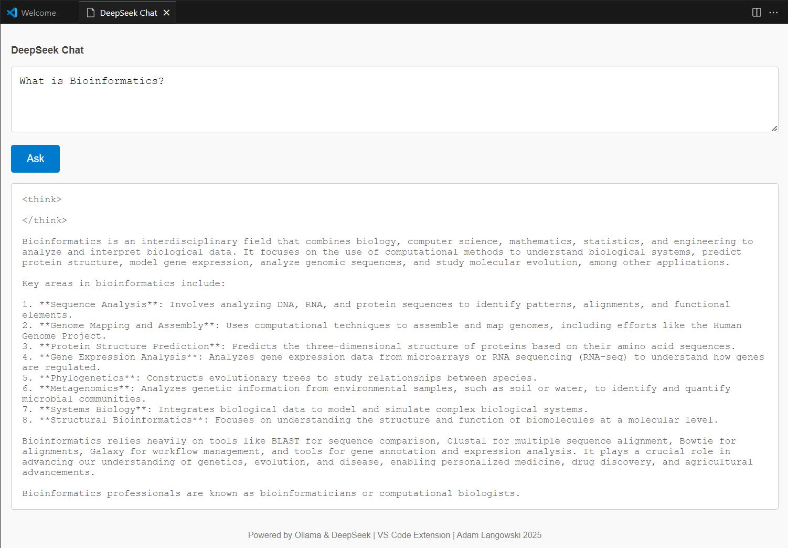
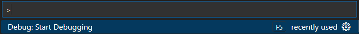
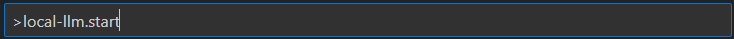
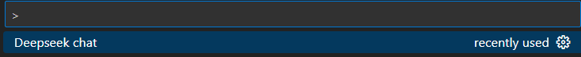
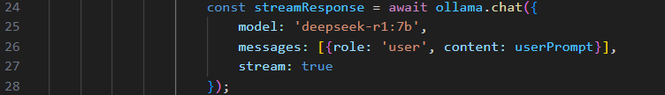

# DeepSeek VS Code Extension

This extension enables running DeepSeek models locally using Ollama. It provides a chat interface within VS Code to interact with the DeepSeek model.



## Prerequisites
Before you begin, ensure you have the following installed:
- [Node.js](https://nodejs.org/) with [npm](https://www.npmjs.com/) 
- [VS Code](https://code.visualstudio.com/) 
- [Ollama](https://ollama.com/)

## How to run

### 1. Download the DeepSeek Model
Run the following command to download the DeepSeek model:
```bash
ollama run deepseek-r1:7b
```
### 2. Clone this repository
```bash
git clone https://github.com/adam-langowski/local-llm-vscode-extension.git
cd local-llm-vscode-extension
```
  
### 3. Inside the project install the required dependencies:
```bash 
nmp i
```
### 4. Start Debugging
Press F5 or go to the Run and Debug section and start debugging.


### 5. Inside a new window run: **local-llm.start**


- After the first usage it will show up as **Deepseek chat**



### **Note**
You can select different models, just remember to adjust this section in **extension.ts** file:

